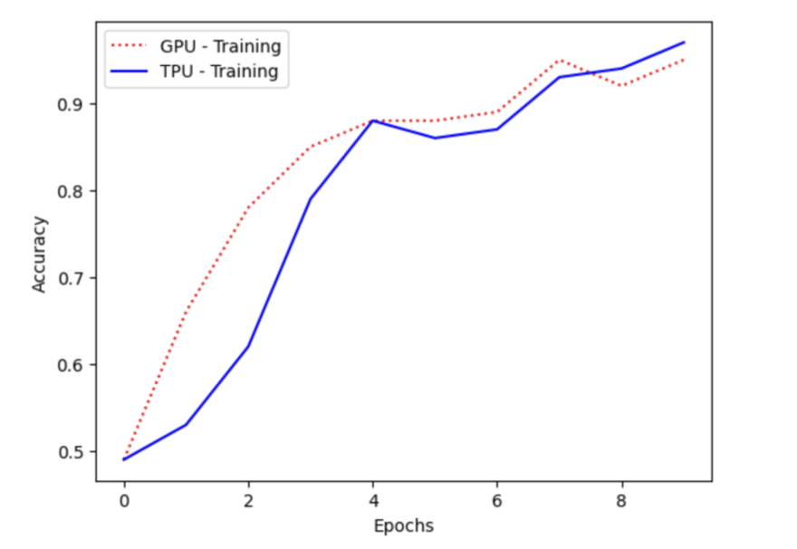
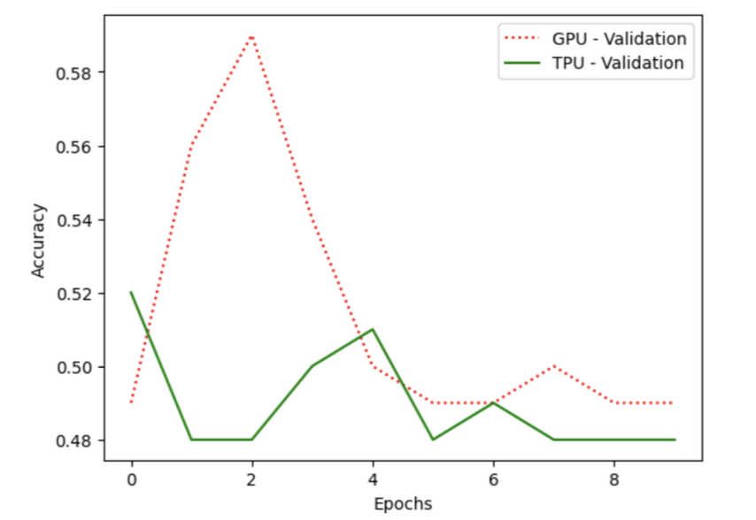

# ACCELERATED IMAGE CLASSIFICATION USING TPU

This project investigates the performance differences between the **NVIDIA Tesla T4 GPU** and **Google TPU** in training a Convolutional Neural Network (CNN) for image classification. Using a dataset of **cats and dogs images**, the project compares training efficiency, computing capabilities, and resource utilization of both hardware accelerators.

---

# OBJECTIVES

- Analyze training and inference time differences between **GPU** and **TPU**.  
- Evaluate model accuracy and performance parity.  
- Understand architectural differences between GPUs and TPUs.  
- Benchmark TPU efficiency for deep learning tasks with large-scale matrix computations.

---

# KEY FINDINGS

1. **Performance Parity**  
   Both GPU and TPU achieved equivalent model accuracy for the image classification task.

2. **Training Time Efficiency**  
   - **GPU Training Time**: ~454 seconds  
   - **TPU Training Time**: ~94 seconds  
   - **Speedup**: ~5x faster on TPU  

3. **Scalability**  
   TPUs demonstrate higher scalability for larger datasets due to parallelized processing.

4. **Resource Utilization**  
   TPUs outperform GPUs for tasks involving matrix multiplication, leveraging their **systolic array architecture**.

---

# IMPLEMENTATION WORKFLOW

1. **Data Preparation**  
   - Dataset: [Cats vs. Dogs](https://www.kaggle.com/datasets/salader/dogs-vs-cats).  
   - Preprocessing images to size `224x224`.  

2. **Model Development**  
   - Built a **Convolutional Neural Network (CNN)** using TensorFlow.  
   - Enabled TPU support with `tf.distribute.TPUStrategy`.  

3. **Training Pipeline**  
   - GPU and TPU training conducted on Google Colab.  
   - Batch size scaled dynamically for TPU replicas.  

4. **Evaluation**  
   - Compared training/validation accuracy and resource efficiency.  

---

# RESULTS

- **Training Time Comparison**  
   | Hardware | Training Time (seconds) | Speedup |
   |----------|-------------------------|---------|
   | GPU      | ~454                    | 1x      |
   | TPU      | ~94                     | 5x      |

- **Accuracy**: Equivalent results for both GPU and TPU models.  

---

# ARCHITECTURAL DIFFERENCES

- **GPU (NVIDIA Tesla T4)**  
   - 40 Streaming Multiprocessors (SMs).  
   - 2560 CUDA cores optimized for parallel computation.  

- **TPU (Google Cloud TPU)**  
   - 8 TPU cores with systolic arrays for matrix operations.  
   - Purpose-built for deep learning workloads.  

---

# HOW TO RUN THE PROJECT

1. **Environment Setup**  
   - Use Google Colab or GCP for TPU access.  
   - Install TensorFlow with TPU support.

2. **Data Requirements**  
   - Download the dataset [here](https://www.kaggle.com/datasets/salader/dogs-vs-cats).  

3. **Execute the Notebook**  
   - Run `main.ipynb` for GPU training.  
   - Run TPU-enabled notebook `TPU_main.ipynb`.  

4. **Verify Outputs**  
   - Compare training times and performance metrics.  

---

# REFERENCES

1. [Kaggle Dataset: Cats vs. Dogs](https://www.kaggle.com/datasets/salader/dogs-vs-cats)  
2. [Google Cloud TPU Documentation](https://cloud.google.com/tpu/docs)  
3. [CampusX Original Implementation](https://colab.research.google.com/drive/14hUmYnsOV-laGY6XjMSXqmoB9E-g5McV?usp=sharing)  
4. [Training ML Models with TPUs](https://www.alter-solutions.com/articles/training-ml-models-with-tpus)  
5. [Tensor Processing Unit (Wikipedia)](https://en.wikipedia.org/wiki/Tensor_Processing_Unit)
